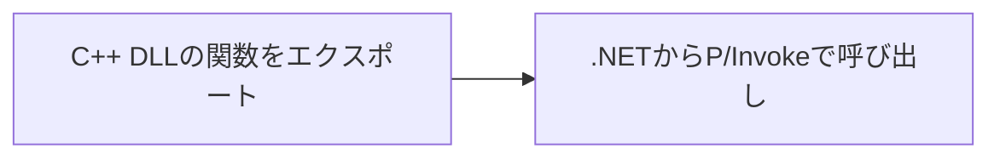

## I. C++/CLI とは
C++/CLI　(Common Language Infrastructure)は、C++に基づいており、.NET の機能を利用できる言語
<br>→ 同一コード内でネイティブコード(C++)とマネージコード(.NET)を両方に使える。

## II. C++/CLI はどういう時に利用するか
既存のC++コードを保守しながら.NETでの開発を進めたい時に利用される。
<br>→ これにより、C++での過去の開発努力を維持しつつ、.NETの利点を生かすことができる。

例：部品マスタデータベースから部品コードを削除する機能は、以下のように実現できる。


※ただし、**P/Invoke**でもこの実現が可能

--------

### III. P/Invokeに比べてC++/CLIの利点

#### P/Invoke（Platform Invocation Services）の仕組み

[作成手順]
##### 1. C++のDLL側には、関数をエクスポート
a. `Sum()`関数作成
```C++
//
extern "C" __declspec(dllexport) int Sum(int a, int b) {
    return a + b;
}
```
b. `.def`ファイル作成
<br>マップファイル(`.map`)生成で関数定義を確認し、`.def`に記載する。
<br>例えば、`Sample.map`は以下の通り
```
//32bitビルドでの.map
0002:00000690       _Sum                       10011690 f   Sample.obj
 
//64bitビルドでの.map
0002:000006a0       Sum                        00000001800116a0 f   Sample.obj
```
この場合は、`.def`ファイルは以下の通りに記載する。
```C++
//Sample.def`ファイル(32bit専用)
EXPORTS
_Sum

//Sample_x64.defファイル
EXPORTS
Sum
```
##### 2. C#側には、.NETからP/Invokeで呼び出し。
```C#
class Program
{
    [DllImport("Sample.dll")]
    private static extern int Sum(int a, int b);
}
```

### P/Invokeの問題
**1. C++のクラスやメソッドを直接公開・呼び出すことはできない。**
<br>代わりに、C++側でラッパー関数を作成し、その関数をエクスポートする必要がある。

**2. ヘッダファイル情報を.NET側に用意する必要がある。**

**3. C++の引数 → .Netの変換コストがかかる。**
<br>一回呼び出しで命令の20個分のオーバーヘッドがかかる。

**4. どんな関数でも正常に呼び出せるわけではない。**
<br>メモリリーク、例外処理の問題がある。

**→ C++/CLIを使うと、これらが解消できる。**

--------------
# IV. C++/CLIの仕組み


ネイティブコード(C++)を一部分だけに.NETで呼び出す。

## 作成手順
1. Visual Studioで「CLRクラスライブラリ」を作成する。
2. 
A. C#でC++のDLLの**関数**を呼び出す場合

B. C#でC++のDLLの**クラスやメソッド**を呼び出す場合


## C++/CLI 文法
ネイティブコードを作成する場合、C++と同じ。
<br>マネージコードを作成する場合、以下の通りに異なる。
### 1. クラス定義
ref キーワードを利用する。
※.NETのガベージコレクションによって管理されるマネージヒープ上にクラスがインスタンス化されることを示すること。
```C++
ref class MyClass {};
```
### 2.トラッキング ハンドル
- マネージオブジェクトのインスタンス化は、`*`の代わりに、`gcnew` キーワードを利用する。
- `gcnew`で生成されたインスタンスへのポインタを取得する場合、`^`キーワードを利用する。

```C++/CLI
MyClass^ myClass = gcnew MyClass;
```

## V. メリット
- C++標準ライブラリ、.NET ライブラリを呼び出すことが可能
  - .NET ライブラリを使えるため、ファイル読み書きがやすくなる。
- P/Invokeよりもいい。
  - 重要なのは、クラスやメソッドを呼び出せるので。
- 拡張メソッドを書ける。

## VI. デメリット
- マネージドメモリ管理とネイティブメモリ管理の違いを理解し、適当に扱う必要がある。
- C++やC#より一般的な言語に比べて、C++/CLIのコミュニティと資料は少ない。


